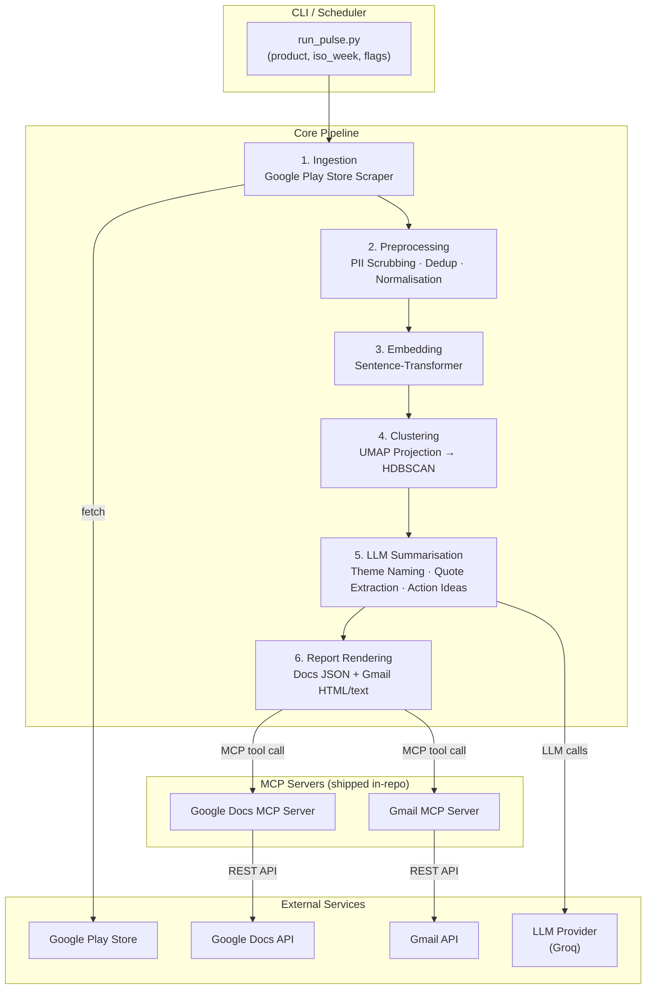
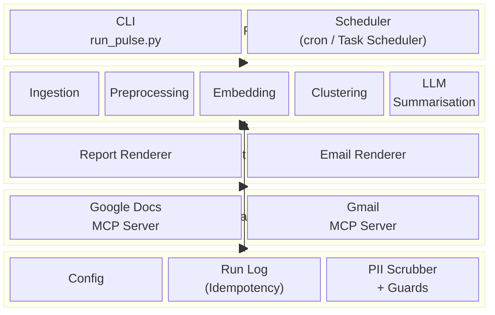
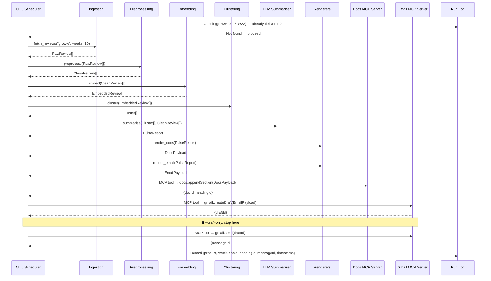
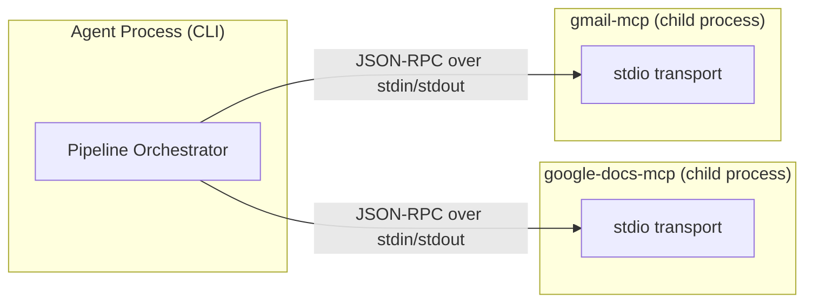
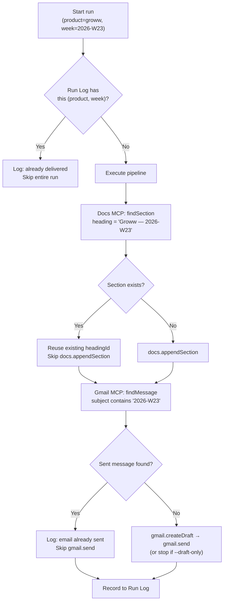
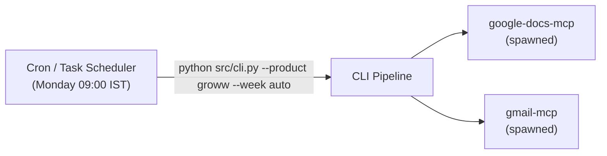

# Architecture — Groww Weekly Review Pulse

> Technical architecture for the automated system that ingests Groww's Google Play Store reviews, clusters them into themes, and delivers a weekly insight report via Google Workspace MCP servers — all shipped as a single self-contained repository.

---

## 1. High-Level System Overview



---

## 2. Component Architecture

### 2.1 Layer Diagram



### 2.2 Component Responsibilities

| Component | Responsibility | Key Interfaces |
|---|---|---|
| **CLI** | Parse args (`product`, `iso_week`, `--dry-run`, `--draft-only`), orchestrate pipeline | Calls pipeline stages sequentially |
| **Ingestion** | Scrape Groww reviews from Google Play Store for the configured time window | Returns `List[RawReview]` |
| **Preprocessing** | PII scrubbing, deduplication, text normalisation, language filtering | `List[RawReview]` → `List[CleanReview]` |
| **Embedding** | Generate vector embeddings for each cleaned review | `List[CleanReview]` → `List[EmbeddedReview]` |
| **Clustering** | UMAP dimensionality reduction → HDBSCAN density clustering → rank clusters by size/sentiment | `List[EmbeddedReview]` → `List[Cluster]` |
| **LLM Summarisation** | Name each cluster as a theme, extract verbatim quotes (validated against source), propose action ideas | `List[Cluster]` → `PulseReport` |
| **Report Renderer** | Convert `PulseReport` into Google Docs JSON batch-update request body | `PulseReport` → `DocsPayload` |
| **Email Renderer** | Convert `PulseReport` into a teaser email (HTML + plain text) with deep link | `PulseReport` → `EmailPayload` |
| **Google Docs MCP Server** | Expose MCP tools: `docs.appendSection`, `docs.findSection` | Wraps Google Docs REST API |
| **Gmail MCP Server** | Expose MCP tools: `gmail.createDraft`, `gmail.send` | Wraps Gmail REST API |
| **Run Log** | Persist per-run delivery metadata for idempotency and auditing | JSON/SQLite keyed by `(product, iso_week)` |
| **Config** | Centralised settings: product definitions, time window, LLM params, stakeholder list | YAML / `.env` |

---

## 3. Data Flow — Single Run



---

## 4. MCP Server Design

### 4.1 What Is MCP in This Context

The agent (CLI pipeline) acts as an **MCP host/client**. It communicates with two **MCP servers** shipped within this repository over `stdio` transport. Each server exposes a set of **tools** that the pipeline invokes.

> [!IMPORTANT]
> The pipeline never imports `google-api-python-client` or holds OAuth tokens directly. All Google API interaction is delegated to the MCP servers, which own their own credential configuration.

### 4.2 Google Docs MCP Server

| Tool | Input | Output | Description |
|---|---|---|---|
| `docs.appendSection` | `{docId, sectionHeading, bodyRequests[]}` | `{headingId}` | Appends a new dated section to the running pulse document. Uses the heading text as an idempotent anchor — if a section with the same heading already exists, returns its ID without duplicating. |
| `docs.findSection` | `{docId, sectionHeading}` | `{found: bool, headingId?, url?}` | Checks whether a section already exists (used for idempotency pre-check and deep-link generation). |

**Credential flow:** The server reads Google OAuth credentials from its own config (e.g. `mcp-servers/google-docs/credentials.json` + token cache), never from the pipeline's environment.

### 4.3 Gmail MCP Server

| Tool | Input | Output | Description |
|---|---|---|---|
| `gmail.createDraft` | `{to[], subject, htmlBody, textBody}` | `{draftId}` | Creates a Gmail draft. Pipeline always creates a draft first, enabling `--draft-only` mode for staging. |
| `gmail.send` | `{draftId}` | `{messageId, threadId}` | Sends a previously created draft. Only called if `--draft-only` is **not** set and idempotency check confirms no prior send for this run. |
| `gmail.findMessage` | `{query}` | `{found: bool, messageId?}` | Searches sent mail by subject/label to verify whether the email for this week was already sent (idempotency). |

### 4.4 MCP Communication



- **Transport:** `stdio` (the agent spawns each MCP server as a child process)
- **Protocol:** JSON-RPC 2.0 per the MCP specification
- **Lifecycle:** Started on demand by the pipeline, shut down after the run completes

---

## 5. Data Models

### 5.1 Core Types

```python
@dataclass
class RawReview:
    review_id: str            # Play Store unique ID
    author: str               # Reviewer display name
    rating: int               # 1–5
    text: str                 # Full review body
    date: datetime            # Review post date
    app_version: str | None   # App version at time of review
    thumbs_up: int            # Helpfulness votes
    reply_text: str | None    # Developer reply (if any)
    reply_date: datetime | None

@dataclass
class CleanReview:
    review_id: str
    rating: int
    text: str                 # PII-scrubbed, normalised
    date: datetime
    app_version: str | None
    thumbs_up: int

@dataclass
class EmbeddedReview:
    review: CleanReview
    embedding: list[float]    # Vector from sentence-transformer

@dataclass
class Cluster:
    cluster_id: int
    reviews: list[CleanReview]
    centroid: list[float]
    size: int
    avg_rating: float

@dataclass
class Theme:
    name: str                 # LLM-generated theme label
    summary: str              # 1–2 sentence description
    quotes: list[str]         # Verbatim quotes (validated against source text)
    action_ideas: list[str]   # LLM-proposed actions
    review_count: int
    avg_rating: float

@dataclass
class PulseReport:
    product: str              # "groww"
    iso_week: str             # e.g. "2026-W23"
    window_weeks: int         # e.g. 10
    total_reviews: int
    themes: list[Theme]
    generated_at: datetime

@dataclass
class RunRecord:
    product: str
    iso_week: str
    doc_id: str
    heading_id: str
    draft_id: str | None
    message_id: str | None
    thread_id: str | None
    generated_at: datetime
    delivered_at: datetime | None
```

### 5.2 Config Schema (YAML)

```yaml
# config.yaml
product:
  name: groww
  play_store_id: com.nextbillion.groww
  display_name: Groww

ingestion:
  window_weeks: 10          # Rolling window for review collection
  max_reviews: 5000         # Safety cap per run
  language: en              # Filter to English reviews

embedding:
  provider: sentence-transformers  # local model (Groq does not offer embeddings)
  model: all-MiniLM-L6-v2
  batch_size: 128

clustering:
  umap:
    n_neighbors: 15
    n_components: 5
    min_dist: 0.0
  hdbscan:
    min_cluster_size: 10
    min_samples: 5

llm:
  provider: groq
  model: llama-3.3-70b-versatile
  max_tokens_per_run: 50000  # Cost guard
  temperature: 0.3

preprocessing:
  pii_scrub: true
  min_review_length: 10      # Characters; skip very short reviews

delivery:
  google_doc_id: "1aBcDeFgHiJkLmNoPqRsTuVwXyZ"  # Target doc ID
  stakeholders:
    - team-product@example.com
    - team-support@example.com
  draft_only: true           # Staging default; set false for production
  email_subject_template: "Groww Review Pulse — Week {iso_week}"

mcp_servers:
  google_docs:
    command: "node"
    args: ["mcp-servers/google-docs/index.js"]
    env:
      GOOGLE_CREDENTIALS_PATH: "mcp-servers/google-docs/credentials.json"
  gmail:
    command: "node"
    args: ["mcp-servers/gmail/index.js"]
    env:
      GOOGLE_CREDENTIALS_PATH: "mcp-servers/gmail/credentials.json"

run_log:
  path: data/run_log.json    # Or SQLite path
```

---

## 6. Idempotency Strategy



**Three-layer idempotency:**

| Layer | Mechanism | Prevents |
|---|---|---|
| **Run Log** | Local `(product, iso_week)` key check before pipeline starts | Re-running the entire pipeline unnecessarily |
| **Google Docs** | `docs.findSection` checks for existing heading with stable anchor text | Duplicate sections in the running document |
| **Gmail** | `gmail.findMessage` searches sent mail by subject pattern | Duplicate stakeholder emails |

---

## 7. Safety & Quality Guards

| Guard | Where Applied | Detail |
|---|---|---|
| **PII scrubbing** | Preprocessing stage, before embedding and LLM | Regex + NER-based removal of emails, phone numbers, names |
| **Quote validation** | LLM Summarisation stage | Every quote in the report is fuzzy-matched against actual review text; unmatched quotes are discarded |
| **Token budget** | LLM Summarisation stage | `max_tokens_per_run` config caps total tokens sent to the LLM; run aborts with a warning if exceeded |
| **Review-as-data** | LLM prompt design | System prompt instructs the LLM to treat reviews as data to analyse, never as instructions to follow (prompt injection defence) |
| **Rate limiting** | Ingestion module | Respects Play Store rate limits; configurable delay between scraping pages |
| **Draft-only mode** | Delivery stage | Default in staging — emails are created as drafts but never sent until explicitly confirmed |

---

## 8. Proposed Directory Structure

```
GrowwReview/
├── docs/
│   ├── problemStatement.md
│   ├── problemStatement.txt
│   └── architecture.md            ← this file
│
├── src/
│   ├── cli.py                     # Entry point: arg parsing, orchestration
│   ├── config.py                  # Load & validate config.yaml
│   │
│   ├── ingestion/
│   │   ├── __init__.py
│   │   └── play_store.py          # Google Play Store scraper for Groww
│   │
│   ├── preprocessing/
│   │   ├── __init__.py
│   │   ├── pii_scrubber.py        # PII detection & removal
│   │   └── normaliser.py          # Text cleanup, dedup, language filter
│   │
│   ├── embedding/
│   │   ├── __init__.py
│   │   └── embedder.py            # Embedding generation (sentence-transformers)
│   │
│   ├── clustering/
│   │   ├── __init__.py
│   │   └── clusterer.py           # UMAP + HDBSCAN pipeline
│   │
│   ├── summarisation/
│   │   ├── __init__.py
│   │   ├── summariser.py          # LLM-based theme/quote/action extraction
│   │   └── prompts.py             # System & user prompt templates
│   │
│   ├── rendering/
│   │   ├── __init__.py
│   │   ├── docs_renderer.py       # PulseReport → Docs JSON payload
│   │   └── email_renderer.py      # PulseReport → HTML + text email
│   │
│   ├── delivery/
│   │   ├── __init__.py
│   │   └── mcp_client.py          # MCP host: spawn servers, invoke tools
│   │
│   ├── models/
│   │   ├── __init__.py
│   │   └── types.py               # Dataclasses: RawReview, CleanReview, etc.
│   │
│   └── utils/
│       ├── __init__.py
│       ├── run_log.py             # Idempotency log (read/write RunRecord)
│       └── helpers.py             # ISO week math, logging setup, etc.
│
├── mcp-servers/
│   ├── google-docs/
│   │   ├── index.js               # MCP server entry point
│   │   ├── tools.js               # Tool definitions (appendSection, findSection)
│   │   ├── google-api.js           # Google Docs REST API wrapper
│   │   ├── package.json
│   │   └── credentials.json       # .gitignored — OAuth client secret
│   │
│   └── gmail/
│       ├── index.js               # MCP server entry point
│       ├── tools.js               # Tool definitions (createDraft, send, findMessage)
│       ├── google-api.js           # Gmail REST API wrapper
│       ├── package.json
│       └── credentials.json       # .gitignored — OAuth client secret
│
├── data/
│   └── run_log.json               # Delivery audit trail (gitignored)
│
├── config.yaml                    # Project configuration
├── requirements.txt               # Python dependencies
├── .env.example                   # Environment variable template
├── .gitignore
└── README.md
```

---

## 9. Technology Choices

| Concern | Technology | Rationale |
|---|---|---|
| **Language (pipeline)** | Python 3.11+ | Rich ML/NLP ecosystem (UMAP, HDBSCAN, sentence-transformers) |
| **Language (MCP servers)** | Node.js (TypeScript) | Official MCP SDK has strong Node.js support; lightweight for I/O-bound API proxying |
| **Play Store scraping** | `google-play-scraper` (npm) or `google_play_scraper` (Python) | Well-maintained, handles pagination, reviews endpoint |
| **Embeddings** | `all-MiniLM-L6-v2` (sentence-transformers) | Local model; no API key needed; Groq does not offer an embeddings API |
| **Dimensionality reduction** | UMAP | Preserves local structure better than t-SNE; works well with HDBSCAN |
| **Clustering** | HDBSCAN | Finds variable-density clusters; no need to pre-specify k |
| **LLM** | Groq `llama-3.3-70b-versatile` | Extremely fast inference via Groq; high quality for summarisation tasks |
| **MCP transport** | stdio | Simplest for co-located processes; no network overhead |
| **Run log** | JSON file (upgrade path → SQLite) | Zero-dependency start; SQLite if audit queries become complex |
| **Config** | YAML + `.env` | Human-readable; secrets in `.env`, settings in YAML |

---

## 10. Error Handling & Observability

### 10.1 Error Strategy

| Stage | Failure Mode | Handling |
|---|---|---|
| Ingestion | Play Store rate limit / network error | Retry with exponential backoff (max 3); abort run on exhaustion |
| Embedding | API timeout / quota exceeded | Retry; fall back to local model if configured |
| Clustering | Too few reviews for meaningful clusters | Emit warning; produce a "low-data" report variant |
| LLM Summarisation | Token budget exceeded | Truncate least-populated clusters; log which were dropped |
| Docs MCP | Auth failure / API error | Abort run; log full error; do not proceed to email |
| Gmail MCP | Draft creation fails | Abort email delivery; docs section remains (partial delivery is logged) |

### 10.2 Logging

- **Structured logging** via Python `logging` with JSON formatter
- Each run tagged with `{product, iso_week, run_id}` for traceability
- Log levels: `DEBUG` (embedding vectors, cluster sizes), `INFO` (stage completion), `WARNING` (quote validation failures, PII detections), `ERROR` (stage failures)

---

## 11. Deployment & Scheduling



- **Weekly schedule:** Monday 09:00 IST via system cron (Linux) or Task Scheduler (Windows)
- **Backfill:** `python src/cli.py --product groww --week 2026-W20` runs a specific past week
- **Dry run:** `python src/cli.py --product groww --dry-run` executes the full pipeline but skips all MCP delivery calls
- **Draft only:** `python src/cli.py --product groww --draft-only` creates the Docs section and Gmail draft but does not send the email

---

## 12. Future Extension Points

> [!NOTE]
> These are out of scope now but the architecture is designed to accommodate them without major refactoring.

| Extension | How the Architecture Supports It |
|---|---|
| **Additional products** | Add a new entry in `config.yaml` with a different `play_store_id`; pipeline is already parameterised by product |
| **Apple App Store** | Add an `ingestion/app_store.py` module returning the same `RawReview` interface; no changes downstream |
| **Additional review sources** | Any new ingestion module that produces `List[RawReview]` plugs in without changes to clustering or rendering |
| **Slack / Teams delivery** | Add a new MCP server under `mcp-servers/slack/`; extend rendering with a Slack block-kit renderer |
| **Dashboard / BI** | Expose `PulseReport` as JSON; a separate frontend can consume the same data |
| **Persistent storage** | Swap `run_log.json` for SQLite or Postgres; the `RunRecord` interface stays the same |
