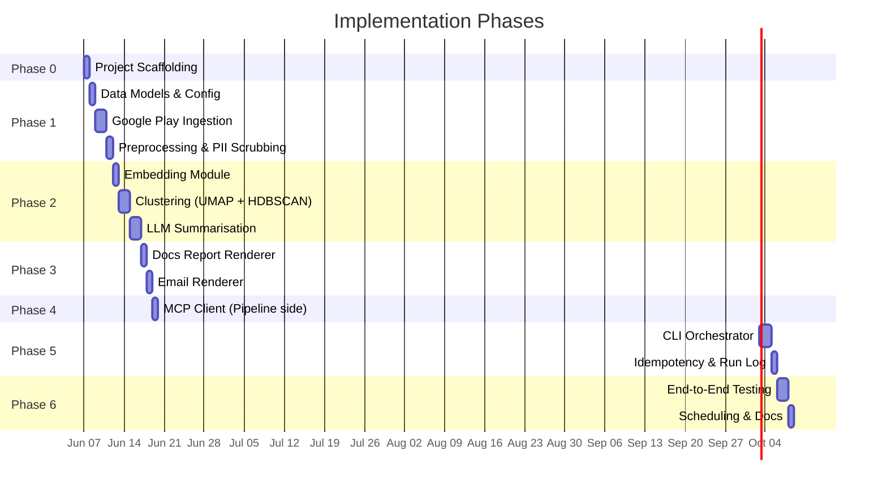
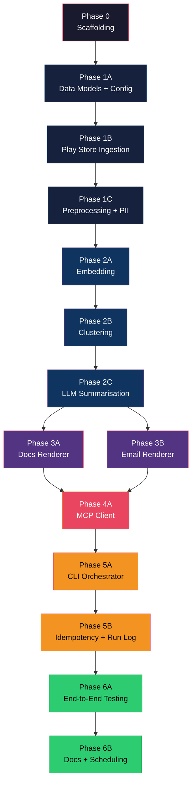

# Implementation Plan — Groww Weekly Review Pulse

> Phase-wise plan to build the automated system that ingests Groww's Google Play Store reviews, clusters them into themes, and delivers a weekly insight report via MCP servers for Google Docs and Gmail.

**Reference documents:**
- [problemStatement.md](file:///c:/Users/Ashish%20Bhardwaj/Downloads/GrowwReview/docs/problemStatement.md)
- [architecture.md](file:///c:/Users/Ashish%20Bhardwaj/Downloads/GrowwReview/docs/architecture.md)

---

## Phase Overview



---

## Phase 0 — Project Scaffolding

> **Goal:** Set up the repository structure, tooling, and configuration so every subsequent phase has a clean foundation.

### Tasks

| # | Task | Files | Detail |
|---|---|---|---|
| 0.1 | Initialise directory structure | All dirs under `src/`, `data/`, `docs/` | Match the structure in [architecture §8](file:///c:/Users/Ashish%20Bhardwaj/Downloads/GrowwReview/docs/architecture.md#L397) |
| 0.2 | Create `requirements.txt` | `requirements.txt` | `google-play-scraper`, `umap-learn`, `hdbscan`, `sentence-transformers`, `groq`, `pyyaml`, `python-dotenv`, `tiktoken`, `fuzzywuzzy` |
| 0.3 | Create `.env.example` | `.env.example` | Template for `GROQ_API_KEY` |
| 0.4 | Create `config.yaml` | `config.yaml` | Full config per [architecture §5.2](file:///c:/Users/Ashish%20Bhardwaj/Downloads/GrowwReview/docs/architecture.md#L290) |
| 0.5 | Create `.gitignore` | `.gitignore` | Ignore `data/`, `*.credentials.json`, `.env`, `__pycache__/`, `node_modules/` |
| 0.6 | Stub `README.md` | `README.md` | Project overview, setup instructions (filled in Phase 6) |
| 0.7 | Init `__init__.py` files | All `src/` subpackages | Empty init files to make packages importable |

### Exit Criteria

- [x] `python -c "import src"` succeeds
- [x] `config.yaml` loads without errors
- [x] Git repo initialised with clean first commit

---

## Phase 1 — Data Layer (Ingestion + Preprocessing)

> **Goal:** Fetch Groww reviews from Google Play Store, clean them, and produce a `List[CleanReview]` ready for embedding.

### 1A — Data Models & Config Loader

| # | Task | File | Detail |
|---|---|---|---|
| 1A.1 | Define all core dataclasses | [types.py](file:///c:/Users/Ashish%20Bhardwaj/Downloads/GrowwReview/src/models/types.py) | `RawReview`, `CleanReview`, `EmbeddedReview`, `Cluster`, `Theme`, `PulseReport`, `RunRecord` per [architecture §5.1](file:///c:/Users/Ashish%20Bhardwaj/Downloads/GrowwReview/docs/architecture.md#L222) |
| 1A.2 | Config loader | [config.py](file:///c:/Users/Ashish%20Bhardwaj/Downloads/GrowwReview/src/config.py) | Parse `config.yaml`, merge `.env` overrides, validate required fields, expose typed `AppConfig` object |
| 1A.3 | Helpers module | [helpers.py](file:///c:/Users/Ashish%20Bhardwaj/Downloads/GrowwReview/src/utils/helpers.py) | `current_iso_week()`, `iso_week_to_date_range()`, structured logging setup |

**Verification:** Unit tests for config loading, ISO week math, and dataclass serialisation.

---

### 1B — Google Play Store Ingestion

| # | Task | File | Detail |
|---|---|---|---|
| 1B.1 | Play Store scraper | [play_store.py](file:///c:/Users/Ashish%20Bhardwaj/Downloads/GrowwReview/src/ingestion/play_store.py) | Use `google-play-scraper` Python package to fetch reviews for `com.nextbillion.groww` |
| 1B.2 | Pagination & windowing | Same file | Fetch reviews within the configured `window_weeks`, paginate up to `max_reviews` cap |
| 1B.3 | Rate limiting | Same file | Configurable sleep between pages to respect Play Store limits |
| 1B.4 | Map to `RawReview` | Same file | Convert scraper's dict output to `RawReview` dataclass instances |

**Verification:**
```bash
python -m src.ingestion.play_store --product groww --weeks 2 --limit 50
# Should print 50 RawReview objects with real data
```

---

### 1C — Preprocessing & PII Scrubbing

| # | Task | File | Detail |
|---|---|---|---|
| 1C.1 | PII scrubber | [pii_scrubber.py](file:///c:/Users/Ashish%20Bhardwaj/Downloads/GrowwReview/src/preprocessing/pii_scrubber.py) | Regex-based removal of emails, phone numbers, Aadhaar-like patterns; replace with `[REDACTED]` |
| 1C.2 | Text normaliser | [normaliser.py](file:///c:/Users/Ashish%20Bhardwaj/Downloads/GrowwReview/src/preprocessing/normaliser.py) | Lowercase, strip excessive whitespace, remove emoji-only reviews, language filter (English), min length filter |
| 1C.3 | Deduplication | Same file | Exact-text dedup by `review_id`; near-duplicate detection (optional, via hash) |
| 1C.4 | Preprocessing orchestrator | [preprocessing/__init__.py](file:///c:/Users/Ashish%20Bhardwaj/Downloads/GrowwReview/src/preprocessing/__init__.py) | `preprocess(raw_reviews) → clean_reviews`: chains PII scrubbing → normalisation → dedup |

**Verification:** Unit tests with synthetic reviews containing PII, duplicates, non-English text.

---

## Phase 2 — Intelligence Layer (Embedding + Clustering + LLM)

> **Goal:** Take cleaned reviews, cluster them by semantic similarity, and produce a structured `PulseReport` with named themes, validated quotes, and action ideas.

### 2A — Embedding Module

| # | Task | File | Detail |
|---|---|---|---|
| 2A.1 | Embedder interface | [embedder.py](file:///c:/Users/Ashish%20Bhardwaj/Downloads/GrowwReview/src/embedding/embedder.py) | Abstract base with `embed(texts) → vectors` |
| 2A.2 | Sentence-Transformer embedder | Same file | `all-MiniLM-L6-v2` local model; no API key needed (Groq does not offer an embeddings API) |
| 2A.3 | Provider selection from config | Same file | Factory function reads `embedding.provider` from config; default is `sentence-transformers` |

**Verification:**
```bash
python -m src.embedding.embedder --text "test review" --provider sentence-transformers
# Should print a 384-dim vector
```

---

### 2B — Clustering (UMAP + HDBSCAN)

| # | Task | File | Detail |
|---|---|---|---|
| 2B.1 | UMAP projection | [clusterer.py](file:///c:/Users/Ashish%20Bhardwaj/Downloads/GrowwReview/src/clustering/clusterer.py) | Reduce embedding dimensions using UMAP with config params (`n_neighbors`, `n_components`, `min_dist`) |
| 2B.2 | HDBSCAN clustering | Same file | Cluster projected vectors; params from config (`min_cluster_size`, `min_samples`) |
| 2B.3 | Cluster ranking | Same file | Sort clusters by size descending; compute `avg_rating` per cluster |
| 2B.4 | Noise handling | Same file | Reviews in HDBSCAN noise cluster (-1) are logged but excluded from themes |
| 2B.5 | Low-data guard | Same file | If < `min_cluster_size` total reviews, return a single "miscellaneous" cluster with a warning |

**Verification:**
```bash
python -m src.clustering.clusterer --input data/test_embeddings.json
# Should print cluster assignments and sizes
```

---

### 2C — LLM Summarisation

| # | Task | File | Detail |
|---|---|---|---|
| 2C.1 | Prompt templates | [prompts.py](file:///c:/Users/Ashish%20Bhardwaj/Downloads/GrowwReview/src/summarisation/prompts.py) | System prompt (review-as-data, no instruction-following), user prompt (cluster reviews → theme name + summary + quotes + action ideas) |
| 2C.2 | Summariser | [summariser.py](file:///c:/Users/Ashish%20Bhardwaj/Downloads/GrowwReview/src/summarisation/summariser.py) | For each `Cluster`, call Groq LLM (`llama-3.3-70b-versatile`) with cluster reviews; parse structured output into `Theme` |
| 2C.3 | Quote validation | Same file | Fuzzy-match each returned quote against actual review texts; discard unmatched (threshold ≥ 85% similarity) |
| 2C.4 | Token budget enforcement | Same file | Track cumulative tokens; skip remaining clusters if `max_tokens_per_run` exceeded; log warning |
| 2C.5 | PulseReport assembly | Same file | Combine all `Theme` objects into a `PulseReport` with metadata (product, iso_week, total_reviews, generated_at) |

**Verification:**
- Unit test: mock LLM responses, verify quote validation catches fabricated quotes
- Integration test: run on real clusters from Phase 2B, verify output structure

---

## Phase 3 — Output Layer (Rendering)

> **Goal:** Convert `PulseReport` into two delivery-ready payloads — one for Google Docs and one for Gmail.

### 3A — Docs Report Renderer

| # | Task | File | Detail |
|---|---|---|---|
| 3A.1 | Build Docs JSON payload | [docs_renderer.py](file:///c:/Users/Ashish%20Bhardwaj/Downloads/GrowwReview/src/rendering/docs_renderer.py) | Convert `PulseReport` → Google Docs API `batchUpdate` request body |
| 3A.2 | Section heading | Same file | Generate stable heading: `"Groww — Review Pulse — 2026-W23"` (used as idempotent anchor) |
| 3A.3 | Content structure | Same file | Heading (H2) → themes table → quotes block → action ideas list → metadata footer |
| 3A.4 | Formatting | Same file | Bold theme names, italic quotes, bullet lists for actions |

**Verification:** Render a sample `PulseReport` to JSON; visually inspect via Google Docs API Explorer or log output.

---

### 3B — Email Renderer

| # | Task | File | Detail |
|---|---|---|---|
| 3B.1 | HTML email builder | [email_renderer.py](file:///c:/Users/Ashish%20Bhardwaj/Downloads/GrowwReview/src/rendering/email_renderer.py) | Top themes as bullet points, brief summary, "Read full report →" CTA link |
| 3B.2 | Plain-text fallback | Same file | Text-only version of the same content |
| 3B.3 | Deep link generation | Same file | Construct `https://docs.google.com/document/d/{docId}/edit#heading=h.{headingId}` URL |
| 3B.4 | Subject line | Same file | Use `email_subject_template` from config, e.g. `"Groww Review Pulse — Week 2026-W23"` |

**Verification:** Render sample email; open HTML in browser to verify layout and link.

---

## Phase 4 — Remote MCP Integration

> **Goal:** Build the pipeline-side MCP client to connect with the pre-built, remote MCP server hosted on Railway.

> [!IMPORTANT]
> The MCP server is already built and deployed to `web-production-131a3.up.railway.app`. The pipeline communicates with it over **SSE** (Server-Sent Events) using JSON-RPC 2.0.

### 4A — MCP Client (Pipeline Side)

| # | Task | File | Detail |
|---|---|---|---|
| 4A.1 | MCP client class | [mcp_client.py](file:///c:/Users/Ashish%20Bhardwaj/Downloads/GrowwReview/src/delivery/mcp_client.py) | Connect to remote MCP server via SSE, send JSON-RPC requests, parse responses |
| 4A.2 | Server connection | Same file | `start()` → connects to `mcp_server.url` from config; `stop()` → graceful disconnect |
| 4A.3 | Tool invocation | Same file | `call_tool(server, tool_name, params) → result` with timeout and error handling |
| 4A.4 | Convenience wrappers | Same file | `append_doc_section(payload)`, `create_draft(payload)`, `send_draft(draft_id)`, `find_doc_section(heading)`, `find_sent_email(query)` |

**Verification:** Integration test: connect to remote MCP server → call `tools/list` → verify response.

---

## Phase 5 — Orchestration Layer

> **Goal:** Wire all components together into the CLI entry point with idempotency enforcement.

### 5A — CLI Orchestrator

| # | Task | File | Detail |
|---|---|---|---|
| 5A.1 | Argument parser | [cli.py](file:///c:/Users/Ashish%20Bhardwaj/Downloads/GrowwReview/src/cli.py) | `--product` (default: groww), `--week` (ISO week or "auto"), `--dry-run`, `--draft-only`, `--force` (skip idempotency) |
| 5A.2 | Pipeline orchestration | Same file | Sequential execution: idempotency check → ingest → preprocess → embed → cluster → summarise → render → deliver |
| 5A.3 | Dry-run mode | Same file | Execute everything through rendering but skip all MCP calls; log what *would* be delivered |
| 5A.4 | Draft-only mode | Same file | Execute full pipeline including Docs MCP, create Gmail draft, but do **not** call `gmail.send` |
| 5A.5 | Error handling | Same file | Catch stage-level exceptions; log errors; ensure MCP connection is closed in `finally` block |
| 5A.6 | Summary output | Same file | Print run summary: reviews ingested, clusters found, themes generated, delivery status |

---

### 5B — Idempotency & Run Log

| # | Task | File | Detail |
|---|---|---|---|
| 5B.1 | Run log read/write | [run_log.py](file:///c:/Users/Ashish%20Bhardwaj/Downloads/GrowwReview/src/utils/run_log.py) | JSON file at `data/run_log.json`; keyed by `(product, iso_week)` |
| 5B.2 | Pre-run check | Same file | `has_run(product, week) → bool`; if True, CLI skips entire pipeline (unless `--force`) |
| 5B.3 | Record run | Same file | `record_run(RunRecord)` — appends delivery metadata after successful completion |
| 5B.4 | Three-layer check in CLI | [cli.py](file:///c:/Users/Ashish%20Bhardwaj/Downloads/GrowwReview/src/cli.py) | Layer 1: run log → Layer 2: `docs.findSection` → Layer 3: `gmail.findMessage` per [architecture §6](file:///c:/Users/Ashish%20Bhardwaj/Downloads/GrowwReview/docs/architecture.md#L354) |

**Verification:**
```bash
# First run — full pipeline
python src/cli.py --product groww --week 2026-W23 --draft-only

# Second run — should skip with "already delivered" message
python src/cli.py --product groww --week 2026-W23 --draft-only

# Force re-run — should execute despite existing log entry
python src/cli.py --product groww --week 2026-W23 --draft-only --force
```

---

## Phase 6 — Testing, Polish & Deployment

> **Goal:** End-to-end validation, documentation, and scheduling setup.

### 6A — End-to-End Testing

| # | Task | Detail |
|---|---|---|
| 6A.1 | Unit tests | Cover all modules: config, ingestion, preprocessing, embedding, clustering, summarisation, rendering, run log |
| 6A.2 | Integration test (dry run) | Full pipeline with `--dry-run` using real Play Store data; verify `PulseReport` structure and content |
| 6A.3 | Integration test (draft only) | Full pipeline with `--draft-only`; verify Docs section is appended; Gmail draft exists but is not sent |
| 6A.4 | Idempotency test | Run same week twice; verify no duplicates in Docs or Gmail |
| 6A.5 | Edge cases | Very few reviews (< 10), all same rating, non-English-heavy dataset, API timeout simulation |

---

### 6B — Documentation & Scheduling

| # | Task | File | Detail |
|---|---|---|---|
| 6B.1 | Complete README | `README.md` | Setup guide, config reference, CLI usage, MCP server setup, OAuth credential setup |
| 6B.2 | Remote MCP reference | `README.md` | Document required remote MCP server URL and connection instructions |
| 6B.3 | Scheduling setup | (system) | Document cron job / Task Scheduler entry for weekly Monday 09:00 IST run |
| 6B.4 | `.env.example` completion | `.env.example` | All required environment variables documented |

---

## Dependency Graph Between Phases



---

## Risk Register

| Risk | Impact | Mitigation |
|---|---|---|
| **Play Store scraping blocked / rate-limited** | No reviews to process | Exponential backoff; cache raw reviews locally; consider official API if available |
| **LLM generates fabricated quotes** | Credibility loss with stakeholders | Quote validation via fuzzy matching (Phase 2C.3); discard unmatched |
| **Google OAuth token expiry during run** | Delivery failure mid-pipeline | MCP servers handle token refresh internally; pipeline retries tool calls once |
| **Insufficient reviews for meaningful clusters** | Low-quality report | Low-data guard (Phase 2B.5); produce simplified "insufficient data" report variant |
| **Token cost overrun** | Unexpected API bills | `max_tokens_per_run` budget with hard enforcement (Phase 2C.4) |
| **Remote MCP server unavailable** | Pipeline hangs or fails | SSE connection timeout/retries; error propagation; `finally` block ensures cleanup (Phase 5A.5) |

---

## Definition of Done

A phase is **complete** when:

1. All tasks in the phase are implemented
2. Unit tests pass for new code
3. Integration with prior phases verified (outputs from phase N feed into phase N+1)
4. Code committed with descriptive message

The **project** is done when:

- [x] `python src/cli.py --product groww --week auto --draft-only` completes a full pipeline run
- [x] Google Docs contains the appended weekly section with themes, quotes, and action ideas
- [x] Gmail draft exists with a correct deep link to the Docs section
- [x] Re-running the same week skips gracefully (idempotency)
- [x] `--dry-run` mode produces output without any delivery side effects
- [x] README documents setup, config, and usage
