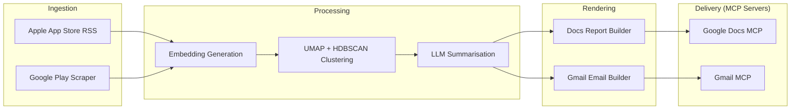

# Groww — Weekly Review Pulse

> An automated weekly "pulse" that turns public Google Play Store reviews for **Groww** into a one-page insight report, delivered to stakeholders through Google Workspace via MCP (Model Context Protocol).

**Supported product:** Groww (Google Play Store only)

---

## Objective

Give **product, support, and leadership teams** a repeatable, weekly snapshot of what Groww customers are saying in Google Play Store reviews — themes, representative quotes, and actionable ideas — without manual copy-paste or one-off spreadsheets.

---

## What the System Does

1. **Ingest** public reviews from the last 8–12 weeks (configurable window) from Google Play Store (scraper-based) for Groww.
2. **Cluster & rank** feedback using embeddings and density-based clustering (UMAP + HDBSCAN), then use an LLM to name themes, pull verbatim quotes, and propose action ideas — with validation so quotes must appear in real review text.
3. **Render** a concise one-page narrative: top themes, quotes, action ideas, and a short "who this helps" section.
4. **Deliver** outputs only through Google Workspace MCP servers:
   - **Google Docs MCP** — append each week's report as a new dated section to a single running document per product (e.g. *Weekly Review Pulse — Groww*). The Doc is the system of record and preserves history.
   - **Gmail MCP** — send a short stakeholder email that includes a deep link to the new section in that Doc (heading link), not a duplicate full report in email alone.

> [!IMPORTANT]
> The agent is an MCP host/client; it does **not** embed Google credentials or call the Docs/Gmail REST APIs directly for delivery. All MCP servers (Google Docs MCP, Gmail MCP) are **created and provided as part of this project**, so the entire system is self-contained within the repository.

---

## Internal Module Separation

| Concern | Where it lives |
|---|---|
| **Data retrieval** | Ingestion module (Google Play Store) |
| **Reasoning** | Clustering + LLM summarisation (themes, quotes, actions) |
| **Output generation** | Report + email rendering (structured for Docs; HTML/text for Gmail) |
| **Human-visible delivery** | MCP tools only → Google Docs MCP + Gmail MCP |

---

## Architecture Overview

---

## Key Requirements

| # | Requirement | Detail |
|---|---|---|
| 1 | **MCP-based delivery** | Append to the shared Google Doc and send Gmail **only** via the respective MCP servers' tools (e.g. document batch update, draft/create/send flows). |
| 2 | **Weekly cadence** | Designed to run once per product per week (e.g. scheduled job Monday morning IST), with a CLI for backfill of any ISO week. |
| 3 | **Idempotent runs** | Re-running the same product + ISO week must **not** create duplicate Doc sections or duplicate sends. Enforced with a stable section anchor in the Doc and a run-scoped idempotency check on email. |
| 4 | **Auditable** | Each run records delivery identifiers (e.g. doc heading / message ids) and enough metadata to answer *"what was sent when, for which week?"* |
| 5 | **Safety & quality** | PII scrubbing on review text before LLM and before publishing; reviews treated as data, not instructions; cost/token limits per run. |

---

## Non-Goals (Explicit)

> [!NOTE]
> These are deliberately out of scope for the initial build.

- A generic Google Workspace product beyond what the pulse needs (Docs append + Gmail send/draft).
- Real-time streaming analytics or a BI dashboard — the running Google Doc is the living artefact.
- Social sources (Twitter, Reddit, etc.).
- Apple App Store reviews (only Google Play Store is in scope).
- Supporting products other than Groww.
- Storing Google OAuth secrets in the agent codebase — they belong in the MCP servers' configuration, per architecture.

---

## Who This Helps

| Audience | Value |
|---|---|
| **Product** | Prioritize roadmap from recurring themes |
| **Support** | Spot repeating complaints and quality issues |
| **Leadership** | Fast health snapshot tied to customer voice |

---

## Sample Output (Illustrative)

### Groww — Weekly Review Pulse

**Period:** Last 8–12 weeks (rolling window)

#### Top Themes

| Theme | Summary |
|---|---|
| **App performance & bugs** | Lag, crashes during trading hours; login/session timeouts |
| **Customer support friction** | Slow responses; unresolved tickets |
| **UX & feature gaps** | Confusing navigation for portfolio insights; missing advanced analytics |

#### Real User Quotes

> *"The app freezes exactly when the market opens, very frustrating."*

> *"Support takes days to reply and doesn't solve the issue."*

> *"Good for beginners but lacks detailed analysis tools."*

#### Action Ideas

1. **Stabilize peak-time performance** — Scale infra during market hours; improve crash visibility.
2. **Improve support SLA visibility** — Expected response time in-app; ticket status tracking.
3. **Enhance power-user features** — Advanced portfolio analytics; clearer investments navigation.

#### What This Solves

Roadmap alignment for product, issue clustering for support, and a leadership-friendly snapshot — now automated, archived in Google Docs, and announced by email with a link back to the canonical section.

---

## Delivery Expectations (Stakeholder-Facing)

> [!WARNING]
> Development/staging may default to **draft-only email** until explicit confirmation to send, per implementation plan.

- Each run adds one clearly labeled section to the product's pulse Google Doc (dated / week-labeled).
- The email is a brief teaser (e.g. top themes as bullets) plus a **"Read full report"** link to that section.
